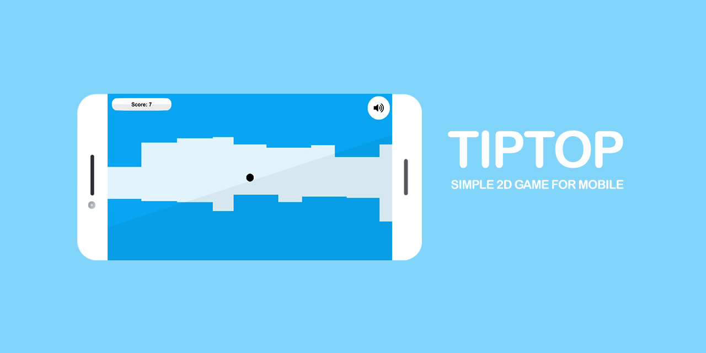

# TIPTOP - A 2D Mobile Game

  
Table of Contents

  <ol>
    <li>
        <a href="#project-description">Project Description</a>
    </li>
    <li>
		<a href="#how-to-contribute">How to Contribute</a>
    </li>
    <li>
        <a href="#how-to-install">How to Install</a>
    </li>
    <li>
        <a href="#how-to-run">How to Run</a>
    </li>
      <li>
        <a href="#controls">Controls</a>
    </li>
    <li>
        <a href="#mobile-download-links">Mobile Download Links</a>
    </li>
    <li>
        <a href="#credits">Credits</a>
    </li>
     <li>
          <a href="#license">License</a>
      </li>
  </ol>

## Project Description
- Tiptop is a simple 2D game created with Unity Engine and C# programming language for mobile devices such as Android and IOS.
- The goal of the game is to float your circle infinitely without hitting any obstacles.
- Features touch screen support, collision detection, a scoring system, and random obstacle generation.
- Encourages new contributors to play around with the project to learn basics of Unity, C#, and Open Source contribution.
- Gameplay can be seen in the gif below.

    

## How to Contribute
- Make sure to have git installed.
- Create your own fork of the project by clicking the fork button in the top right.
- Clone the repository on your local machine, using git clone and pasting the url of this project.
- Read the `How to Install` section below.
- All gameplay files can be found in `src/assets` for modifications. Make sure to keep this file convention for organizational purposes.
- Commit and push your changes.
- Make a pull request when finished modifying the project.

## How to Install
- After creating your fork and cloning the repo, install the latest version of [Unity](https://unity.com/download).
- In the Unity Hub, open the src folder in the repo as a project or make a new project and merge the src folders.
- This will create a copy of the project in Unity, on your machine. 
- You are now completely ready to contribute and modify whatever you like.

## How to Run
- To run the game on PC, you must click the play button in Unity or build the game.
- To build the game, go to build settings tab and click `build and run`, this will prompt you to choose a directory for the build. 
- It is strongly reccomended that you create a folder inside the cloned repo dedicated for the build.
- This creates an exe that you can now run to play the game.

## Controls
- Mobile - Touch screen controls.
- PC - Use the left mouse button to float the circle and click menus.

## Mobile Download Links
- [APKPure](https://apkpure.com/p/ir.geraked.tiptop).
- [Cafebazaar](https://cafebazaar.ir/app/ir.geraked.tiptop).
- [Myket](https://myket.ir/app/ir.geraked.tiptop).

## Credits
**Rabist [AUTHOR]** - view on [LinkedIn](https://www.linkedin.com/in/rabist).

## License
Tiptop is licensed under the [MIT LICENSE](LICENSE). This means you can modify it however you want as long as the original copyright and license are included in your release.
